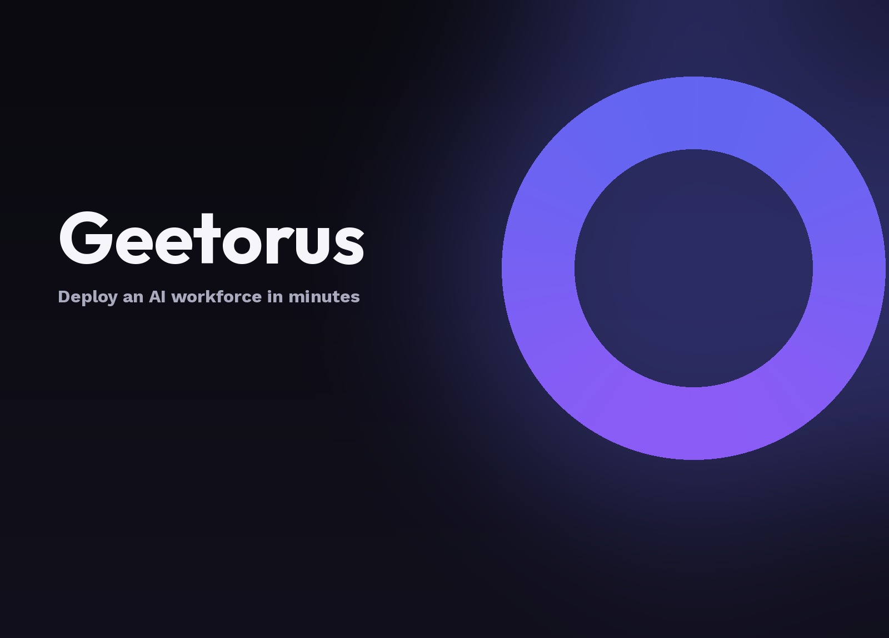

<p align="center">
  
</p>

<p align="center">
  <a href="#quickstart"><strong>Quickstart</strong></a> &middot;
  <a href="#core-features"><strong>Features</strong></a> &middot;
  <a href="#architecture"><strong>Architecture</strong></a> &middot;
  <a href="#development"><strong>Development</strong></a> &middot;
  <a href="#license"><strong>License</strong></a>
</p>

<p align="center">
  <a href="LICENSE"></a>
  
  
  
</p>

<br/>

# Geetorus

**Open-source orchestration platform for teams of AI agents.**

Geetorus is a full-featured control plane and orchestration system that organizes teams of AI agents to execute complex goals. Bring your own agents, assign goals, and track progress, workspaces, and costs from a single unified dashboard.

Instead of babysitting individual chat tabs, terminal sessions, or fragile scripts, Geetorus models a complete organization: org charts, reporting hierarchies, token budgets, atomic task checkout, approval gates, and heartbeat execution.

<br/>

| Step | Action | Example |
| :--- | :--- | :--- |
| **01** | **Define the Goal** | _"Build and launch an AI-driven documentation generator with automated testing."_ |
| **02** | **Deploy the Team** | Chief of Staff, Architects, Engineers, Reviewers — any model, any provider. |
| **03** | **Govern & Run** | Set token budgets, configure review gates, hit run, and monitor from the board. |

<br/>

<div align="center">
<table>
  <tr>
    <td align="center"><strong>Works<br/>with</strong></td>
    <td align="center"><br/><sub>OpenCode</sub></td>
    <td align="center"><br/><sub>Claude Code</sub></td>
    <td align="center"><br/><sub>Codex</sub></td>
    <td align="center"><br/><sub>Cursor</sub></td>
    <td align="center"><br/><sub>Bash</sub></td>
    <td align="center"><br/><sub>HTTP / Webhooks</sub></td>
  </tr>
</table>

<em>If it can receive a heartbeat, it can be orchestrated.</em>
</div>

<br/>

## Core Features

<table>
<tr>
<td align="center" width="33%">
<h3>🔌 Bring Your Own Agent</h3>
Connect local free models via OpenCode or Ollama, cloud models (Claude, Codex, Gemini), CLI agents, or custom HTTP bots.
</td>
<td align="center" width="33%">
<h3>🎯 Goal Alignment</h3>
Every task traces back through project and organization goals. Agents always know <em>what</em> to do and <em>why</em>.
</td>
<td align="center" width="33%">
<h3>💓 Heartbeat Execution</h3>
Agents wake on schedules (cron routines) or reactively on task assignment. Sessions persist across reboots.
</td>
</tr>
<tr>
<td align="center">
<h3>💰 Budget & Cost Controls</h3>
Monthly token and dollar limits per agent and project. When limits are reached, agents stop cleanly with no runaway spend.
</td>
<td align="center">
<h3>🏢 Multi-Organization</h3>
Run multiple companies or projects within a single deployment with complete workspace and data isolation.
</td>
<td align="center">
<h3>🎫 Ticket & Task System</h3>
Atomic task checkouts, dependency graphs, sub-issues, and audit trails. No duplicate work or lost context.
</td>
</tr>
<tr>
<td align="center">
<h3>🛡️ Governance & Approval Gates</h3>
Human-in-the-loop review gates for high-impact actions, strategy overrides, and pause/resume controls.
</td>
<td align="center">
<h3>📊 Org Chart & Hierarchy</h3>
Define roles, reporting structures, and permissions. Agents have a clear position and job description.
</td>
<td align="center">
<h3>🧩 Runtime Skill Injection</h3>
Dynamically inject project skills, workflows, and tools into agent workspaces at runtime without retraining.
</td>
</tr>
</table>

<br/>

## Why Geetorus?

| Challenge | With Geetorus |
| :--- | :--- |
| **Lost context across restarts** | Tasks are ticket-based, sessions are persistent, and progress is saved across reboots. |
| **Runaway token spend** | Granular budget policies enforce limits with automatic warning thresholds and hard stops. |
| **Uncoordinated agent chaos** | Org charts, delegation hierarchies, and atomic task locks keep agents working together smoothly. |
| **Babysitting terminal tabs** | Background heartbeats and scheduled routines execute autonomously while you monitor from the board. |
| **Manual context delivery** | Task hierarchy, project goals, and company objectives flow directly into prompt context. |

<br/>

## Architecture

```
┌──────────────────────────────────────────────────────────────┐
│                       GEETORUS SERVER                        │
│                                                              │
│  ┌───────────┐  ┌───────────┐  ┌───────────┐  ┌───────────┐  │
│  │Identity & │  │  Work &   │  │ Heartbeat │  │Governance │  │
│  │  Access   │  │   Tasks   │  │ Execution │  │& Approvals│  │
│  └───────────┘  └───────────┘  └───────────┘  └───────────┘  │
│                                                              │
│  ┌───────────┐  ┌───────────┐  ┌───────────┐  ┌───────────┐  │
│  │ Org Chart │  │Workspaces │  │  Plugins  │  │  Budget   │  │
│  │ & Agents  │  │ & Runtime │  │  System   │  │ & Costs   │  │
│  └───────────┘  └───────────┘  └───────────┘  └───────────┘  │
│                                                              │
│  ┌───────────┐  ┌───────────┐  ┌───────────┐  ┌───────────┐  │
│  │ Routines  │  │ Secrets & │  │ Activity  │  │ Blueprint │  │
│  │& Schedules│  │  Storage  │  │ & Audit   │  │  Export   │  │
│  └───────────┘  └───────────┘  └───────────┘  └───────────┘  │
└──────────────────────────────────────────────────────────────┘
         ▲              ▲              ▲              ▲
   ┌─────┴─────┐  ┌─────┴─────┐  ┌─────┴─────┐  ┌─────┴─────┐
   │ OpenCode  │  │  Claude   │  │   Codex   │  │ HTTP/CLI  │
   │  (Free)   │  │   Code    │  │   Runner  │  │  Agents   │
   └───────────┘  └───────────┘  └───────────┘  └───────────┘
```

<br/>

## Quickstart

### Prerequisites
- **Node.js**: `24.11.0` or newer
- **pnpm**: `9.15.0` or newer

### 1. Interactive Onboarding
Run onboarding to set up your organization, hire your first agent (e.g. using free local OpenCode models or cloud API keys), and initialize the database:

```bash
pnpm geetorusai onboard --yes
```

Or using `npx`:

```bash
npx geetorusai onboard --yes
```

### 2. Running from Source

Clone and install dependencies:

```bash
git clone https://github.com/geetorusai/geetorus.git
cd geetorus
pnpm install
```

Start the full development environment (API server + Web UI):

```bash
pnpm dev
```

- **Web Dashboard**: `http://localhost:5173` (or port assigned by Vite)
- **API Server**: `http://localhost:3100`
- Embedded database migrations run automatically on boot.

<br/>

## CLI Commands

The `@geetorusai/cli` package provides full administrative capabilities:

```bash
# Start interactive onboarding
geetorusai onboard

# Run onboarding non-interactively with defaults
geetorusai onboard --yes

# Start the server daemon
geetorusai start

# Update server and agent configuration
geetorusai configure

# Export and import organization blueprints
geetorusai company export <company-id> --out ./backup
geetorusai company import ./backup

# Launch an isolated foreground test instance
geetorusai test-drive
```

<br/>

## Development

```bash
pnpm dev              # Full dev (API server + UI, watch mode)
pnpm dev:server       # Server only
pnpm build            # Build all packages
pnpm typecheck        # Run TypeScript type check across monorepo
pnpm test             # Run unit tests (Vitest)
pnpm test:watch       # Vitest in watch mode
pnpm db:generate      # Generate database migrations
pnpm db:migrate       # Apply migrations
```

<br/>

## Company Blueprints (Import / Export)

Geetorus allows exporting entire organizations — agents, skills, projects, routines, and issue templates — into a portable package:

```bash
geetorusai company export <company-id> --out ./my-company
geetorusai company import ./my-company --dry-run
geetorusai company import ./my-company
```

Secrets are sanitized on export and re-prompted upon import.

<br/>

## Telemetry

Geetorus collects anonymous usage telemetry to improve agent orchestration stability and developer experience. No prompts, task content, code files, or secrets are ever collected.

Telemetry is enabled by default and can be disabled via:
- Environment variable: `GEETORUS_TELEMETRY_DISABLED=1`
- Standard convention: `DO_NOT_TRACK=1`
- Configuration file: `telemetry.enabled: false`

<br/>

## License

Geetorus is open-source software licensed under the [MIT License](LICENSE).
